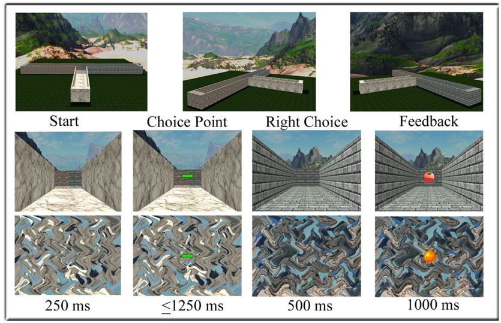
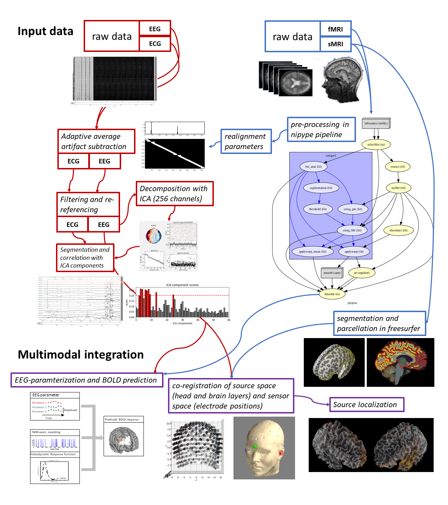

# EEG_fMRI_tmaze

> This repository is a collection of scripts and functions for analyzing simultaneously recorded EEG-fMRI data acquired while running an adaptation of a T-Maze task (i.e. _[Baker & Holroyd, 2009][baker_holroyd]_). Furthermore, we present developmental methods for correcting MR related artifacts in EEG data. 



### General rational of the study

For decades, T-maze paradigms have been used extensively across several animal species (e.g. mice, rodents, ferrets, cats) to investigate
navigation and, thereby, a “real-life” goal-directed behavior. The simplicity of the T-maze paradigm belies its utility and versatility 
for examining goal-directed navigation, and such investigations have produced a wealth of information about spatial learning and memory, 
long-term reference memory, perseveration, reinforcement learning, effort-based decision making, and foraging strategies in response to 
different reinforcement contingencies. This line of research has also indicated that animals bind reinforcement experience with spatial 
context in the service of common goals, a process coordinated by multiple interacting neural systems. Yet, in humans, the interaction 
between these systems during goal-directed behavior is still poorly understood. 
Here, we present a comprehensive analysis of human electrophysiological and hemodynamic responses to reinforcement in a virtual T-maze 
paradigm, providing new evidence for this high-level integration of spatial and reinforcement information in humans. These results provide 
the spectral, temporal, and spatial architecture of goal-directed navigation in humans. 
Together, we propose that imaging humans navigating a simple virtual T-maze can be utilized as a powerful translational model by which to 
map the dynamic interaction between disparate neural systems underlying “real-life” goal-directed behavior in both health and disease.

### Documentation

The entire progress of this study starting Feb. 2019 is documented in the _[open lab notebook][opl]_ in this repository.
Links to notebook entries featuring supplementary information for specific topics relating to this study (design, analyses, etc) are referenced below.

### Contents of this repository

```
under construction
``` 

## Getting Started

### Prerequisites

Analyses are written in Python 2.7, Python 3.6, R, and Matlab. 

```
under construction
``` 

### Dependencies

```
under construction
``` 

## Usage examples

For more detailed description of how and for what reason analysis pipelines were designed please see respective entries
in the _[open lab notebook][opl]_.

### General workflow



### Preprocessing

The gross workflow illustrated above is covered in the numbered jupyter notebooke _[here][jp]_.

```
under construction
```

## Contributing

1. Fork it (<https://github.com/MalteGueth/EEG_fMRI_tmaze/fork>)
2. Create your feature branch (`git checkout -b feature/`)
3. Commit your changes (`git commit -am `)
4. Push to the branch (`git push origin feature/`)
5. Create a new Pull Request

<!-- Markdown -->
[baker_holroyd]: https://academic.oup.com/cercor/article/19/8/1708/413785
[lap_page]: http://neurostimlab.com
[jp]: https://github.com/MalteGueth/EEG_fMRI_tmaze/tree/master/preprocessing
[opl]: https://github.com/MalteGueth/EEG_fMRI_tmaze/tree/master/open%20lab%20notebook
