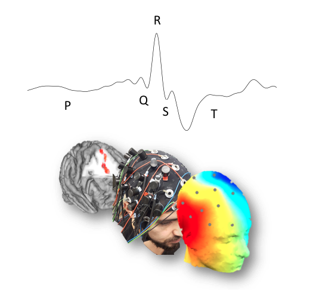
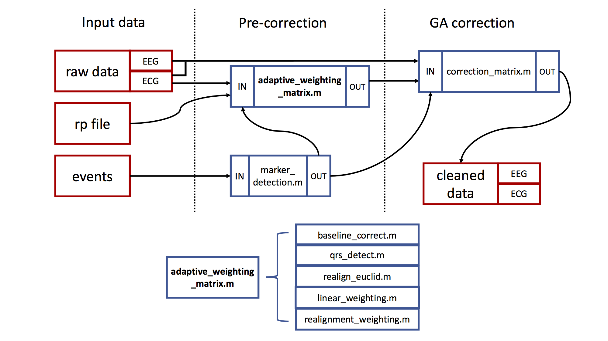

# Adaptive gradient correction
> Performs a gradient artifact correction for EEG data recorded during simultaneous fMRI acquisition which can be informed by movement and heart beat parameters

The functions contained in this repository directory were created to provide a number of adaptive correction approaches
for removing gradient artifacts from EEG signals recorded in the MRI environment. These aim to account
for head movements as well as distortions of the average artifact through ballistocardiac artifacts.

The outlined analyses are adapted from the approaches presented in Allen, Josephs, & Turner (2000) as well as 
Moosmann, Schoenfelder, Specht Scheeringa, Nordby, & Hudgahl (2009). Their original functions can be found in
this _[repository][bergen_toolbox]._

This project is pursued as an assignment for the graduate course 'Scientific Programming in Matlab' (Behavioral
and Neural Sciences Program, Rutgers University Newark). Example data has been collected in the _[Baker Laboratory
for Cognitive Neuroimaging and Stimulation][lap_page]._




## Getting Started

### Prerequisites

All of the analyses are written for Matlab R1018b and can be performed without eeglab (see Usage example). 

### Usage example and typical workflow

First, download the motion data and example workspace. The folder 'example_data' contains the former, which is necessary for performing the analysis. A full workspace with a complete data set (EEG, ECG, experimental information) can be downloaded from the link in the readme in that folder.

When you have the data, make sure you have them as well as the following functions on your path: adaptive_weighting_matrix.m, linear_weighting.m, marker_detection.m, qrs_detect.m, realign_euclid.m, realignment_weighting.m, correction_matrix.m and baseline_correct.m, find_ecg_outliers

Then, use:

```
artifactOnsets = marker_detection(events,TR_marker);
```

The input arguments are given in the example workspace - a cell array of event samples and the name of the marker set after each TR. To use the adaptive_weighting_matrix.m function you at least need to provide the number of scans and the size of the correction template (n_template). For more features like ECG informed corrections, you should pass the sampling rate, ECG data and the output from the above function to the function. See default values and descriptions for further information on the input arguments. A possible usage for an ECG-informed and realignment-informed weighting matrix might look like this:

```
[weighting_matrix,realignment_motion,ecg_outliers] = adaptive_weighting_matrix(scans, n_template, 'rp_file', rp_file, 'sfreq', sfreq, 'ECG', ECG, 'TR', TR, 'events', artifactOnsets);
```
Output plots for this specific example can be found in the plots folder.

The default value for the ECG-informed weighting matrix is set to the variance of the QRS complex. Use 'ecg_feature' and one of the available ECG parameters ('r_peak', 'qrs', 'pq_time', 'qt_time', 'st_amp').
Alternatively, if just a realignment-informed matrix is requested or even a non-modified weighting matrix, pass either only the number of scans and the number of scans constituting the template window length or both plus a realignment parameter file, the sampling rate, the TR and the TR event timings.

No modification:

```
[weighting_matrix,~,~] = adaptive_weighting_matrix(scans, n_template);
```

Only realignment-informed:

```
[weighting_matrix,realignment_motion,~] = adaptive_weighting_matrix(scans, n_template, 'rp_file', rp_file, 'sfreq', sfreq, 'TR', TR, 'events', artifactOnsets);
```

Regardless of the kind of weighting matrix, a baseline correction should be performed on the continuous data next:

```
EEGbase = baseline_correct(EEG, n_channels, TR, artifactOnsets, weighting_matrix, 1, 0, TR);
```

After TR timings were extracted, the weighting matrix has been built and the input data was baseline corrected, the actual correction on the raw EEG data can be applied:

```
EEG_GA_corrected = correction_matrix(EEGbase, n_channels, weighting_matrix, artifactOnsets, 0, TR);
```



### Running tests

```
under construction
```

## Contributing

1. Fork it (<https://github.com/MalteGueth/EEG_fMRI_tmaze/fork>)
2. Create your feature branch (`git checkout -b feature/`)
3. Commit your changes (`git commit -am `)
4. Push to the branch (`git push origin feature/`)
5. Create a new Pull Request

<!-- Markdown link & img dfn's -->
[bergen_toolbox]: https://github.com/jnvandermeer/BergenToolboxModified
[lap_page]: http://neurostimlab.com
